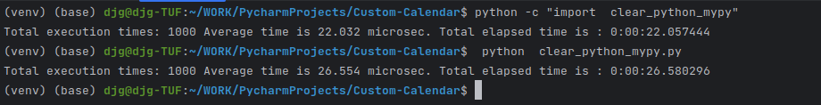

### SandBox
some kind 

Есть матрица расписания запусков, см. рисунок.

Первая строка – 15-и минутные интервалы, вторая строка часовые интервалы, третья строка дни недели, четвертая дни месяца, пятая месяцы года. С помощью данной матрицы задается периодичность запусков.

Требуется написать функцию на Oracle PL/SQL, которая бы возвращала дату следующего запуска (тип Date) от двух входных параметров:
Первый параметр (тип Date): дата, от которой ведется отчет;
Второй параметр (тип Varchar2): это текстовая переменная, в которой перечислены все выбранные ячейки. Ячейки разделены «,» (запятой), а строки разделены «;» (точкой с запятой), например, для данного рисунка расписание будет выглядеть следующим образом: 0,45;0,4,8,12,17,22;2,6;1,2,3,4,5,11,18,24;1,2,3,9,11;

**Контрольный пример**:

        Дата отсчета: 09.07.2010 23:36
        Строка: 0,45;12;
        1,2,6;
        3,6,14,18,21,24,28;
        1,2,3,4,5,6,7,8,9,10,11,12;

Результат: **18.07.2010 12:00**

_Примечание. В данном примере, используется американский календарь, в котором 1 – это воскресенье, 2 – понедельник и т.д._

**В проекте представлены реализации.**

1. pure python
1. pandas python
1. rx python

Algorithmic approach is the same for all 3 solutions, used modules are different

**Игра в песочнице с параллельными вычислениями.**

Загрузка процессора на одном потоке 
0:01:08.996542 - one thread

Загрузка процессора на множестве потоков
0:01:39.427702 - multi threads

Разница во времени (множество потоков VS один поток) - 31 секунда.  
Удивительно, преимущество за одним потоком  
Еще поэкспериментирую над инструментами запуска многопоточности

Если обернуть в один поток в RX - то время разницы сокращается на 15 секунд.

После get started with mypyc( читается мойпайк, а не как вы прочитали. :) ) такая картина получилась.

Прирост не впечатляет, однако есть и изменения в коде: только прописанные типы возвращаемых значений и типизированые переменные.
(see file: clear_python_mypy.py)
